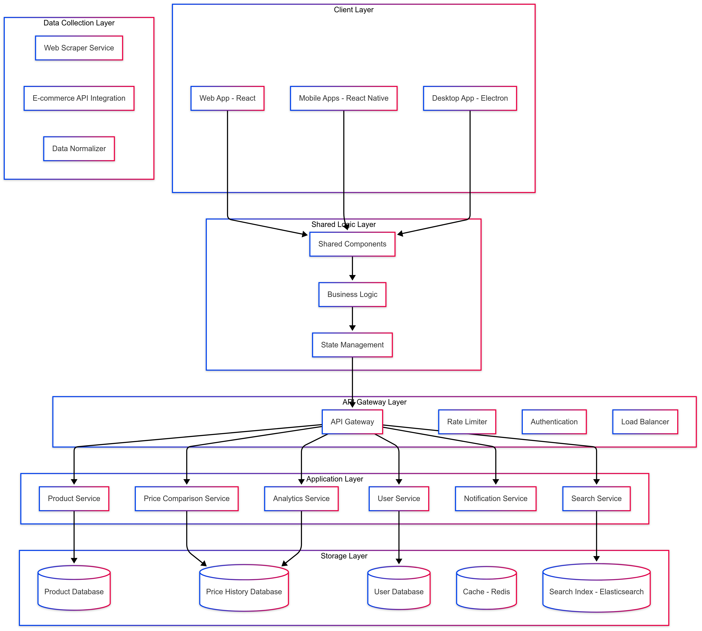
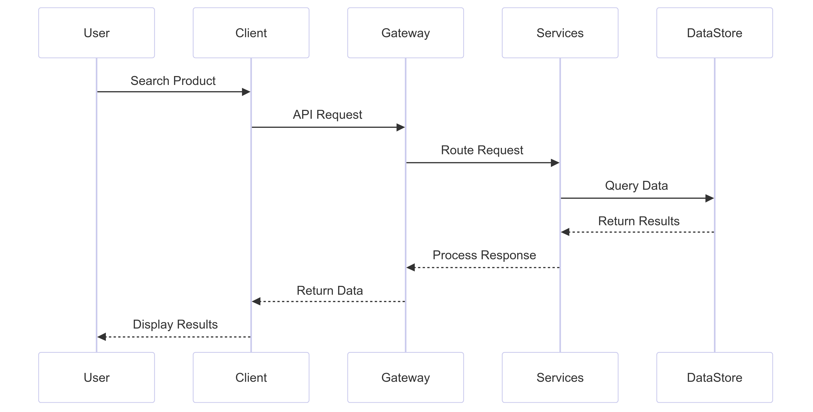

# Design for GlamSage

## High Level Design (HLD)




## 1. System Overview

### 1.1 Purpose
GlamSage is a cross-platform price comparison system for cosmetic products that helps users find the best prices across multiple e-commerce platforms. The system aggregates product information and prices from various sources, providing real-time comparisons and price alerts.

### 1.2 Architecture Goals
- Cross-platform accessibility
- Real-time price updates
- Scalable data collection
- High performance and reliability
- Secure user data handling
- Consistent user experience

## 2. System Architecture

### 2.1 Core Components

#### Client Layer
- React Native mobile applications (iOS/Android)
- Web application (React.js)
- Desktop application (Electron)
- Shared business logic layer

#### API Gateway Layer
- Request routing and load balancing
- Authentication and authorization
- Rate limiting
- Request/Response transformation
- API versioning
- SSL/TLS termination

#### Application Layer
- Product Service
- Price Comparison Service
- User Service
- Search Service
- Notification Service
- Analytics Service

#### Data Collection Layer
- Web Scraper Service
- E-commerce API Integration
- Data Normalization Service

#### Storage Layer
- Product Database (MongoDB)
- Price History Database (TimescaleDB)
- User Database (PostgreSQL)
- Cache Layer (Redis)
- Search Index (Elasticsearch)

### 2.2 System Interaction Flow



## 3. Component Details

### 3.1 Client Applications
- **Technologies**: React Native, React.js, Electron
- **Shared Features**:
  - Product search and filtering
  - Price comparison views
  - Price history graphs
  - Price alerts management
  - User preferences
  - Wishlist management

### 3.2 API Gateway
- **Implementation**: AWS API Gateway/Kong
- **Features**:
  - JWT Authentication
  - Rate limiting
  - Request validation
  - Response caching
  - API documentation
  - Monitoring and analytics

### 3.3 Core Services

#### Product Service
- Product catalog management
- Product metadata handling
- Category management
- Brand management
- Product relationship mapping

#### Price Comparison Service
- Real-time price aggregation 
- Historical price analysis
- Price trend detection
- Best deal identification
- Price alert processing

#### User Service
- User account management
- Authentication/Authorization
- Preference management
- Wishlist handling
- User activity tracking

#### Search Service
- Full-text search
- Faceted search
- Product recommendations
- Search analytics
- Auto-suggestions

#### Notification Service
- Price drop alerts
- Custom price alerts
- Email notifications
- Push notifications
- In-app notifications

#### Analytics Service
- User behavior analysis
- Price trend analysis
- Platform performance metrics
- Search pattern analysis
- Conversion tracking

## 4. Data Management

### 4.1 Data Storage
- **Product Data**: MongoDB
  - Flexible schema for varying product attributes
  - High read performance
  - Document-based storage

- **Price History**: TimescaleDB
  - Time-series data optimization
  - Efficient historical queries
  - Data retention policies

- **User Data**: PostgreSQL
  - ACID compliance
  - Relational data structure
  - Transaction support

### 4.2 Caching Strategy
- **Multi-level Caching**:
  - Browser/App cache
  - API Gateway cache
  - Application cache
  - Database cache

- **Cache Invalidation**:
  - Time-based expiration
  - Event-based invalidation
  - Partial cache updates

## 5. Integration Architecture

### 5.1 E-commerce Platform Integration
- Amazon API integration
- Flipkart API integration
- Nykaa API integration
- Myntra API integration
- Custom scraping solutions

### 5.2 Third-party Services
- Payment gateway integration
- Email service providers
- Push notification services
- Analytics platforms
- Error tracking services

## 6. Security Architecture

### 6.1 Authentication & Authorization
- OAuth 2.0 implementation
- JWT token management
- Role-based access control
- Session management
- API key management

### 6.2 Data Security
- End-to-end encryption
- Data encryption at rest
- Secure data transmission
- PII data handling
- Security audit logging

## 7. Scalability & Performance

### 7.1 Scalability Approach
- Horizontal scaling
- Microservices architecture
- Container orchestration
- Load balancing
- Database sharding

### 7.2 Performance Optimization
- CDN integration
- Response compression
- Query optimization
- Caching strategies
- Lazy loading

## 8. Monitoring & Reliability

### 8.1 System Monitoring
- Service health monitoring
- Performance metrics
- Error tracking
- User behavior analytics
- Resource utilization

### 8.2 Reliability Measures
- Service redundancy
- Data backup
- Disaster recovery
- Circuit breakers
- Fallback mechanisms

## 9. Development & Deployment

### 9.1 Development Workflow
- Git-based version control
- Feature branch workflow
- Code review process
- Automated testing
- CI/CD pipeline

### 9.2 Deployment Strategy
- Containerized deployment
- Blue-green deployment
- Rolling updates
- Environment management
- Configuration management

## 10. Future Considerations

### 10.1 Scalability Enhancements
- Geographic distribution
- Multi-region deployment
- Enhanced caching
- Search optimization
- Performance tuning

### 10.2 Feature Extensions
- AI-powered price predictions
- Enhanced product recommendations
- Social features integration
- AR product visualization
- Voice search capability

Code Sharing
- Can share up to 70-80% of code between platforms
- Common components library
- Shared state management (Redux/MobX)
- Unified API integration layer

Potential Challenges to Consider working with React Native:

1. Platform-Specific Features
- Some advanced features might need native modules
- Platform-specific UI/UX considerations
- Custom bridges for native functionality
- Different navigation patterns between platforms

2. Performance Edge Cases
- Complex animations might need native implementation
- Heavy computational tasks need careful optimization
- Bridge overhead for frequent native communication
- Memory management considerations

3. App Size
- Slightly larger app size due to JavaScript engine
- Need to implement code splitting
- Optimization required for initial load time

Recommended Implementation Approach:

1. Architecture
- Use React Native for mobile apps
- Keep React web app for browser access
- Share core business logic and components
- Use Electron for desktop with shared web components

2. State Management
- Implement Redux/MobX for global state
- Share state logic across platforms
- Centralized API integration layer
- Common authentication flow

3. UI/UX
- Design system with platform-specific variants
- Shared core components
- Platform-specific navigation patterns
- Responsive layouts for different screen sizes

4. Development Workflow
- Single repository (monorepo) setup
- Shared TypeScript types
- Common testing infrastructure
- Automated CI/CD pipeline

Given your requirements for a cosmetic product comparison app, React Native would be a more suitable choice because:

1. Feature Set Compatibility
- The app's main features (product listing, comparison, price tracking) work well with React Native
- UI components needed are well-supported
- No heavy computational requirements
- Limited need for platform-specific features

2. Development Speed
- Faster MVP development
- Quicker feature iterations
- Easier maintenance
- Better resource allocation

3. Cost Effectiveness
- Reduced development team size
- Shared QA resources
- Lower maintenance overhead
- Faster updates across platforms


## Low Level Design (LLD)


## 1. Database Schemas

### Product Schema (MongoDB)
```javascript
{
  _id: ObjectId,
  name: String,
  brand: String,
  category: String,
  subCategory: String,
  description: String,
  ingredients: [String],
  images: [String],
  attributes: {
    size: String,
    weight: Number,
    color: String,
    variant: String
  },
  metadata: {
    created_at: Timestamp,
    updated_at: Timestamp,
    is_active: Boolean
  }
}
```

### Price Schema (TimescaleDB)
```sql
CREATE TABLE product_prices (
  price_id SERIAL PRIMARY KEY,
  product_id UUID NOT NULL,
  platform_id INT NOT NULL,
  price DECIMAL(10,2) NOT NULL,
  discount_price DECIMAL(10,2),
  currency VARCHAR(3),
  stock_status BOOLEAN,
  url TEXT,
  timestamp TIMESTAMPTZ NOT NULL
);
```

### User Schema (PostgreSQL)
```sql
CREATE TABLE users (
  user_id UUID PRIMARY KEY,
  email VARCHAR(255) UNIQUE NOT NULL,
  password_hash TEXT NOT NULL,
  first_name VARCHAR(50),
  last_name VARCHAR(50),
  preferences JSONB,
  created_at TIMESTAMPTZ DEFAULT NOW(),
  last_login TIMESTAMPTZ
);

CREATE TABLE price_alerts (
  alert_id UUID PRIMARY KEY,
  user_id UUID REFERENCES users(user_id),
  product_id UUID NOT NULL,
  target_price DECIMAL(10,2),
  platform_id INT,
  is_active BOOLEAN DEFAULT true,
  created_at TIMESTAMPTZ DEFAULT NOW()
);
```

## 2. API Endpoints

### Product Service
```
GET /api/v1/products
  - Query params: category, brand, page, limit
  - Returns paginated product list

GET /api/v1/products/{id}
  - Returns detailed product info
  - Includes current prices across platforms

POST /api/v1/products/compare
  - Body: [product_ids]
  - Returns comparison data

GET /api/v1/products/{id}/price-history
  - Query params: platform_id, timeframe
  - Returns historical price data
```

### User Service
```
POST /api/v1/auth/register
POST /api/v1/auth/login
POST /api/v1/auth/refresh-token

GET /api/v1/users/wishlist
POST /api/v1/users/wishlist
DELETE /api/v1/users/wishlist/{product_id}

POST /api/v1/alerts
GET /api/v1/alerts
PUT /api/v1/alerts/{alert_id}
DELETE /api/v1/alerts/{alert_id}
```

### Search Service
```
GET /api/v1/search
  - Query params: q, filters, sort, page, limit
  - Returns search results with facets

GET /api/v1/suggest
  - Query params: q
  - Returns autocomplete suggestions
```

## 3. Component Interactions

### Price Update Flow
1. Web Scraper/API Integration Service:
   ```javascript
   {
     schedule: "*/30 * * * *",  // Run every 30 minutes
     concurrent_requests: 50,
     retry_attempts: 3,
     platforms: {
       amazon: {
         rate_limit: 1000,  // requests per hour
         timeout: 5000      // milliseconds
       },
       // ... other platforms
     }
   }
   ```

2. Data Normalization Rules:
   ```javascript
   {
     price_extraction: {
       remove_currency: true,
       convert_to_base: "USD",
       handle_decimals: true
     },
     product_matching: {
       fields: ["name", "brand", "size"],
       threshold: 0.85  // similarity threshold
     }
   }
   ```

### Notification System
```javascript
// Notification Templates
{
  price_drop: {
    title: "Price Drop Alert: {{product_name}}",
    body: "Price dropped to {{new_price}} on {{platform}}",
    actions: ["view_product", "disable_alert"]
  }
}

// Delivery Channels
{
  channels: ["push", "email", "in_app"],
  retry_policy: {
    max_attempts: 3,
    backoff: "exponential"
  }
}
```

## 4. Client-Side Components (React Native)

### State Management (Redux)
```javascript
// Store Structure
{
  auth: {
    user: UserType,
    token: string,
    loading: boolean
  },
  products: {
    list: Product[],
    selected: Product,
    comparison: ComparisonData,
    loading: boolean
  },
  search: {
    query: string,
    filters: FilterState,
    results: SearchResult[],
    loading: boolean
  },
  alerts: {
    list: Alert[],
    loading: boolean
  }
}
```

### Core Components
```typescript
// Product Card Component
interface ProductCardProps {
  product: Product;
  showPrices: boolean;
  onCompare: (id: string) => void;
  onAlert: (id: string) => void;
}

// Price History Chart
interface PriceHistoryProps {
  productId: string;
  timeframe: TimeFrame;
  platforms: string[];
}

// Search Filters
interface FilterProps {
  categories: Category[];
  brands: string[];
  priceRange: [number, number];
  onFilter: (filters: FilterState) => void;
}
```

## 5. Security Implementation

### Authentication Flow
1. JWT Configuration:
```javascript
{
  access_token_expiry: "1h",
  refresh_token_expiry: "7d",
  encryption_algorithm: "RS256",
  token_payload: {
    user_id: string,
    email: string,
    roles: string[]
  }
}
```

2. Rate Limiting:
```javascript
{
  window: "15m",
  max_requests: {
    authenticated: 100,
    anonymous: 30
  },
  excluded_routes: [
    "/api/v1/products"
  ]
}
```

## 6. Caching Strategy

### Redis Cache Configuration
```javascript
{
  product_cache: {
    ttl: 3600,  // 1 hour
    max_size: "1GB"
  },
  search_cache: {
    ttl: 300,   // 5 minutes
    max_size: "500MB"
  },
  price_cache: {
    ttl: 600,   // 10 minutes
    max_size: "2GB"
  }
}
```

### Cache Invalidation Rules
```javascript
{
  triggers: {
    price_update: ["product_cache", "search_cache"],
    product_update: ["product_cache", "search_cache"],
    user_action: ["user_specific_cache"]
  }
}
``
